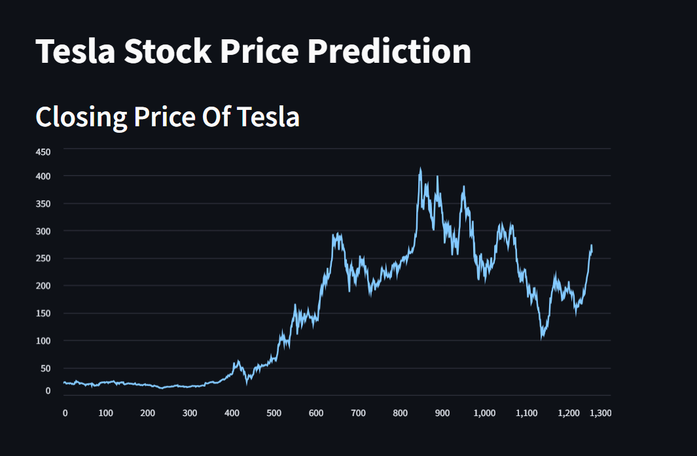

# Stock Market Prediction (Streamlit App)



This Streamlit web app provides an interactive interface to visualize and predict Tesla's stock prices using a deep learning model built with LSTM (Long Short-Term Memory).

## 🚀 Features

📊 Data Visualization
   - Displays Tesla's historical closing prices.
   - Plots **100-day** and **200-day** moving averages for trend analysis.

🔮 Stock Price Prediction
   - Uses an **LSTM**-based deep learning model to predict stock prices.
   - Allows users to input the number of future days for prediction.
   - Visualizes predicted vs. actual stock prices with line charts

📉 Model Evaluation
   - Predictions on test data are compared with actual prices using metrics like:
     - **Mean Absolute Error (MAE)**.
     - **Mean Squared Error (MSE)**.
     - **R2 Score**.

   - Provides graphical representations:
     - Line chart for predicted vs. actual prices.
     - Scatter plot to visualize the correlation between predictions and actual values.
     - R2 score represented as a horizontal bar chart.

🛠️ Installation & Setup

5. **Moving Average Analysis:**
   - Computes and visualizes the **100-day** and **200-day moving averages** for trend comparison.

## How to Run the Streamlit App =>

1. Install required libraries:
   ```bash
   pip install streamlit pandas numpy matplotlib scikit-learn tensorflow
   
2️⃣ Download the Dataset

Save the dataset (`TSLA Training.csv`) in the appropriate directory.

3️⃣ Run the Streamlit App

   ```bash
     streamlit run app.py
